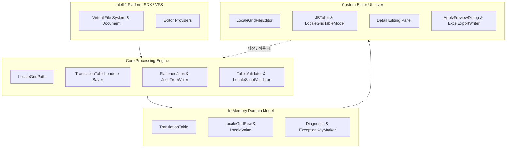
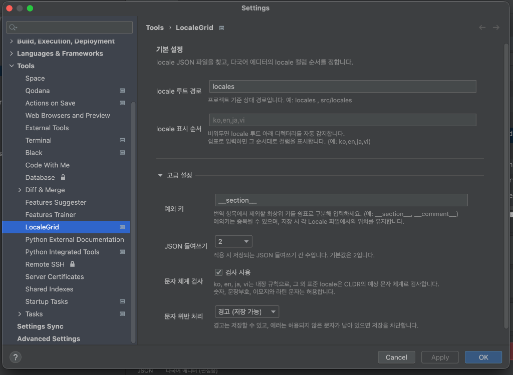

# LocaleGrid 개발 기능 보고서

본 문서는 IntelliJ 및 PyCharm 기반 개발 환경에서 다국어 리소스 JSON 파일을 효율적이고 안정적으로 관리하기 위해 개발된 **LocaleGrid** 플러그인의 주요 기능과 시스템 구조를 기술한 개발 기능 보고서입니다. 본 보고서는 프로젝트 개발에 적용된 핵심 아키텍처와 도메인 모델, 계층형 데이터 처리 및 유니코드 기반 검증 엔진, 사용자 인터페이스와 2단계 저장 메커니즘을 중심으로 구성되었습니다.

---

## 1. 프로젝트 개요 및 개발 배경

### 1.1 개발 배경 및 문제 정의
프로젝트 개발에서 다국어 지원(i18n/l10n)은 필수적이나, 기존 개발 환경에서는 다음과 같은 문제점과 비효율이 존재했습니다:
- **다중 파일 분산 관리의 비효율**: 언어별 다국어 파일(`locales/ko/category.json`, `locales/en/category.json` 등)이 물리적으로 분리되어 있어, 특정 키의 번역 누락이나 번역값 간의 불일치를 확인하기 위해 여러 탭을 오가며 수작업으로 비교해야 했습니다.
- **JSON 계층 구조 훼손 및 구문 오류**: JSON의 계층형 트리 구조(Nested Object)를 텍스트 에디터로 직접 편집할 때 문법 오류(Syntax Error), 콤마 누락, 괄호 불일치, 그리고 중첩 키와 리프 키 간의 경로 충돌(Dot-path conflict)이 발생하기 쉬웠습니다.
- **타 언어 문자 혼입 및 문자 체계 불일치**: 번역 작업 중 한국어 리소스에 라틴 문자나 키릴 문자가 섞이거나, 일본어 리소스에 한글이 잘못 입력되는 등의 문자 체계 불일치를 개발 또는 빌드 시점에 인지하지 못해 배포 후 런타임 오류나 UI 깨짐 현상으로 이어졌습니다.
- **수작업 다국어 검수 과정의 휴먼 에러**: 개발자가 수많은 다국어 키와 번역문을 일일이 확인하고 검수하는 과정에서 누락, 오기입, 불일치 등의 인적 오류(Human Error)가 빈번하게 발생하며, 이를 사전에 체계적으로 감지하기 어려웠습니다.

### 1.2 LocaleGrid의 해결 과제 및 목적
**LocaleGrid**는 이러한 문제를 해결하기 위해 IntelliJ Platform SDK를 기반으로 개발된 전용 다국어 그리드 에디터 플러그인입니다:
1. **다국어 데이터 테이블 통합 뷰**: 선택된 다국어 파일을 기준으로 동일 카테고리에 속한 모든 언어 데이터를 단일 데이터 테이블로 구성하여 한눈에 확인하고 비교·편집할 수 있습니다.
2. **사전 문제 확인 및 데이터 무결성 지원**: 중복 키, Dot Path 충돌, 유니코드 문자 체계(Script) 위반 등의 문제를 실시간으로 감지하여 저장 전에 사전에 확인할 수 있도록 지원합니다.
3. **듀얼 에디터 탭(JSON / 다국어 에디터) 동기화**: 원본 JSON 탭과 다국어 에디터 탭이 함께 제공됩니다. 다국어 데이터를 변경하기 전까지는 JSON 원본 내용이 변경되면 다국어 에디터로 자동 동기화되며, 다국어 에디터에서 편집이 시작되면(`다국어 에디터 (편집중)`) 동기화가 일시 해제되어 편집 내용이 유지됩니다. 이후 변경 내용을 적용하거나 취소하기 전까지 작업 데이터가 보존됩니다.
4. **필터링된 내용 엑셀 다운로드**: 현재 테이블에서 검색 및 상태 필터가 적용된 내용을 엑셀(`.xlsx`) 파일로 다운로드할 수 있습니다.

---

## 2. 시스템 아키텍처 및 핵심 도메인 모델

LocaleGrid는 계층화된 모듈 구조로 설계되어 플랫폼 통합, 코어 처리, 데이터 모델, 사용자 인터페이스가 유기적이면서도 독립적으로 동작하도록 구현되었습니다.

### 2.1 도메인 모델 설계

- **[`TranslationTable`](file:///Users/dave/Desktop/Workspace/LocaleGrid/src/main/java/com/localegrid/model/TranslationTable.java)**
  - 특정 카테고리(`category`)와 연결된 모든 다국어 파일의 인메모리 테이블 컨테이너입니다.
  - 행 목록(`List<LocaleGridRow>`), 로케일 목록(`List<String>`), 파일 매핑(`Map<String, File>`), 예외 키 마커(`Map<String, List<ExceptionKeyMarker>>`), 진단 정보(`List<Diagnostic>`) 및 키 순서 변경 플래그(`orderChanged`)를 종합적으로 관리합니다.
- **[`LocaleGridRow`](file:///Users/dave/Desktop/Workspace/LocaleGrid/src/main/java/com/localegrid/model/LocaleGridRow.java)**
  - 하나의 번역 키(Key)에 대응하는 레코드 단위입니다.
  - 원래 키(`originalKey`)와 현재 키(`key`), 원본 타입(`originalType`)과 현재 행 타입(`RowType: TRANSLATION | EXCEPTION_KEY`), 추가 여부(`added`), 삭제 보류 여부(`deleted`)를 캡슐화합니다.
  - `isModified()` 메서드를 통해 키 이름 변경, 타입 전환, 삭제 상태, 개별 로케일 값의 수정 여부를 즉시 판별합니다.
- **[`LocaleValue`](file:///Users/dave/Desktop/Workspace/LocaleGrid/src/main/java/com/localegrid/model/LocaleValue.java)**
  - 행 내에서 특정 로케일에 바인딩된 실제 번역 값 단위입니다.
  - 원본 값(`Object value`), 원본 JSON 파일 내 존재 여부(`present`), 편집 가능 여부(`editable`: 문자열 또는 null만 true), 수정 여부(`modified`)를 정밀하게 관리합니다.
  - 배열(Array), 객체(Object), 숫자(Number), 불리언(Boolean) 등 비문자열 구조는 `editable = false`로 보호하여 원본 구조의 왜곡을 방지합니다.
- **[`Diagnostic`](file:///Users/dave/Desktop/Workspace/LocaleGrid/src/main/java/com/localegrid/model/Diagnostic.java)**
  - 에디터 검증 및 파싱 중 발생한 오류(`Severity.ERROR`)와 경고(`Severity.WARNING`)의 불변 객체입니다.
  - 메시지, 문제 발생 키, 특정 로케일 정보를 포함하여 UI 툴팁, 상태 배지, 저장 차단 로직에 활용됩니다.
- **[`ExceptionKeyMarker`](file:///Users/dave/Desktop/Workspace/LocaleGrid/src/main/java/com/localegrid/model/ExceptionKeyMarker.java)**
  - 번역 대상에서 제외되는 최상위 메타데이터 키(예: `__section__`, `__comment__` 등)의 상대적 위치(인접한 일반 번역 키의 `BEFORE` 또는 `AFTER`)를 보존하기 위한 앵커 객체입니다.

---

## 3. 주요 기능 소개

### 3.1 파일 탐색 및 듀얼 에디터 탭 제공
- **이중 파일 패턴 지원 ([`LocaleGridPath`](file:///Users/dave/Desktop/Workspace/LocaleGrid/src/main/java/com/localegrid/core/LocaleGridPath.java))**:
  - `locales/{locale}/{category}.json` 패턴과 `locales/{locale}/{category}_{locale}.json` 접미사 패턴을 모두 자동으로 인식합니다.
  - 열린 파일의 상위 폴더 구조를 역추적하여 프로젝트 설정의 `localesRoot`와 정합성을 판별합니다.
- **JSON 원본 탭과 다국어 에디터 탭 통합 ([`LocaleGridJsonFileEditorProvider`](file:///Users/dave/Desktop/Workspace/LocaleGrid/src/main/java/com/localegrid/editor/LocaleGridJsonFileEditorProvider.java))**:
  - 로케일 JSON 파일을 열면 기본 텍스트 에디터 대신 `JSON` 탭([`LocaleGridJsonSourceEditor`](file:///Users/dave/Desktop/Workspace/LocaleGrid/src/main/java/com/localegrid/editor/LocaleGridJsonSourceEditor.java))과 `다국어 에디터` 탭([`LocaleGridFileEditor`](file:///Users/dave/Desktop/Workspace/LocaleGrid/src/main/java/com/localegrid/editor/LocaleGridFileEditor.java))이 나란히 제공됩니다.

- **동기화 및 편집 상태 보존 정책**:
  - 다국어 에디터에서 값을 수정하기 전까지는 `JSON` 탭에서 소스를 직접 수정해도 다국어 에디터에 실시간으로 자동 반영됩니다.
  - 다국어 에디터에서 데이터 수정이 시작되면 탭 이름이 아래와 같이 `다국어 에디터 (편집중)`으로 변경되며 외부 동기화가 일시 해제됩니다.
  - 작업 중인 데이터는 사용자가 [적용]하거나 [취소]하기 전까지 안전하게 유지됩니다.

- **편집 중 탭 전환 보호 알림**:
  - 다국어 에디터에서 값을 수정한 상태(`편집중`)에서 원본 `JSON` 탭으로 전환을 시도할 경우, 저장되지 않은 변경 사항이 있음을 알리고 사용자의 확인을 거치도록 다이얼로그를 표시합니다.

### 3.2 순서 보존 JSON 평탄화 및 역직렬화
- **순서 보존 커스텀 파서 ([`FlattenedJson.OrderedParser`](file:///Users/dave/Desktop/Workspace/LocaleGrid/src/main/java/com/localegrid/core/FlattenedJson.java))**:
  - `LinkedHashMap`을 사용하여 원본 파일의 키 선언 순서를 100% 보존합니다.
  - 동일 레벨의 중복 키(Duplicated JSON key) 발견 시 임의로 덮어쓰지 않고 즉시 `Severity.ERROR` 진단으로 등록합니다.
- **Dot Path 계층 트리 재구성기 ([`JsonTreeWriter`](file:///Users/dave/Desktop/Workspace/LocaleGrid/src/main/java/com/localegrid/core/JsonTreeWriter.java))**:
  - 점 표기법(예: `login.password`)으로 관리되는 데이터를 원래의 중첩 JSON 객체 트리로 역변환합니다.
  - 특정 키가 이미 문자열 리프 노드인데 하위 객체가 추가되거나, 반대로 객체 노드인데 문자열로 덮어쓰려는 시도를 트리 생성 단계에서 감지하여 사전에 차단합니다. 2-space 들여쓰기를 표준 적용합니다.

### 3.3 유니코드 스크립트 기반 다국어 문자 체계 검증
- **언어별 정밀 정책 정의 ([`LocaleScriptPolicy`](file:///Users/dave/Desktop/Workspace/LocaleGrid/src/main/java/com/localegrid/core/LocaleScriptPolicy.java))**:
  - `ko`: 한글(`HANGUL`), 라틴(`LATIN`) 허용
  - `en`: 라틴(`LATIN`) 허용
  - `ja`: 히라가나(`HIRAGANA`), 가타카나(`KATAKANA`), 한자(`HAN`), 라틴(`LATIN`) 허용
  - `vi`: 라틴(`LATIN`) 허용
- **CLDR likely-subtags 자동 추론**:
  - 내장 규칙에 없는 표준 로케일(예: `ru`, `ar`, `th`, `el` 등)이 유입되면, ICU4J의 `ULocale.addLikelySubtags()`를 활용하여 해당 언어의 기본 문자 체계를 자동으로 추론합니다.
- **범용 예외 허용 및 이모지 보호**:
  - 공통 구두점/문장부호(`UnicodeScript.COMMON`), 결합 문자(`INHERITED`), 숫자(`\p{N}`), 유니코드 이모지 범위(`\x{1F000}-\\x{1FAFF}`)는 모든 언어에서 유효한 문자로 통과시킵니다.
- **고성능 캐싱 및 진단 엔진 ([`LocaleScriptValidator`](file:///Users/dave/Desktop/Workspace/LocaleGrid/src/main/java/com/localegrid/core/LocaleScriptValidator.java))**:
  - 부정 정규식 패턴을 `ConcurrentHashMap`에 캐싱하여 대용량 번역 데이터도 지연 없이 즉시 검증합니다.
  - 위반 문자 발생 시 `"허용되지 않은 문자: 안, 녕 (문자 체계: 한글)"` 형태의 명확한 요약 메시지를 실시간 생성합니다.

### 3.4 2-Tier 에디터 UI 및 편의 기능
[`LocaleGridFileEditor`](file:///Users/dave/Desktop/Workspace/LocaleGrid/src/main/java/com/localegrid/editor/LocaleGridFileEditor.java)는 상단의 전체 매트릭스 그리드와 하단의 상세 편집 패널로 구성되어 있습니다.

- **상태 배지 시스템 ([`LocaleGridStatusRenderer`](file:///Users/dave/Desktop/Workspace/LocaleGrid/src/main/java/com/localegrid/editor/LocaleGridStatusRenderer.java))**:
  - `추가`(초록), `편집`(파랑), `경고`(주황), `삭제`(회색), `에러`(빨강)의 시각적 배지를 제공하며, 복수 상태 발생 시 다중 배지를 렌더링합니다.
- **원클릭 다중 상태 필터링**:
  - 툴바 상단의 상태 버튼을 클릭하여 추가된 행, 경고가 있는 행, 편집된 행, 삭제 예정 행, 에러가 있는 행만 즉시 필터링하여 조회할 수 있습니다.
- **디바운스 실시간 검색 및 하이라이팅 ([`SearchHighlightTextArea`](file:///Users/dave/Desktop/Workspace/LocaleGrid/src/main/java/com/localegrid/editor/SearchHighlightTextArea.java), [`SwingDebouncer`](file:///Users/dave/Desktop/Workspace/LocaleGrid/src/main/java/com/localegrid/editor/SwingDebouncer.java))**:
  - 500ms 디바운서를 적용하여 검색어 입력 시 일치 항목을 실시간으로 파란색 배경과 볼드 텍스트로 하이라이트합니다.
  - 이전/다음 버튼을 통해 검색 결과 간 순회 이동이 가능하며, `검색 결과만 보기` 필터를 제공합니다.
- **드래그 앤 드롭 행 순서 재정렬**:
  - 좌측 핸들 열(0번 컬럼)을 마우스로 드래그하거나 툴바의 이동 버튼(`▲`, `▼`)을 사용하여 번역 키의 물리적 순서를 자유롭게 변경할 수 있습니다.
- **스크롤 미니맵 바 (`StatusScrollMap`)**:
  - 수직 스크롤바 트랙 위에 에러(빨강), 경고(주황), 수정(파랑), 추가(초록) 위치를 도트 마커로 표시하여 문제가 있는 행으로 즉시 이동할 수 있습니다.
- **하단 상세 편집 패널 (Detail Panel)**:
  - 선택된 키의 언어별 번역값을 개별 입력 필드에서 편리하게 편집할 수 있으며, 인라인 진단 메시지를 통해 검증 결과를 실시간으로 안내합니다.
- **특수문자 및 개행 보존 ([`LocaleTextEscaper`](file:///Users/dave/Desktop/Workspace/LocaleGrid/src/main/java/com/localegrid/model/LocaleTextEscaper.java))**:
  - 번역문에 포함된 `\n`, `\r`, `\t` 문자를 에디터 셀 내에서 안전하게 이스케이프하여 레이아웃 붕괴를 방지합니다.
- **변경 취소 안전 다이얼로그**:
  - 에디터 하단의 `[취소]` 버튼을 클릭할 때 저장되지 않은 변경 사항이 존재하면, 원본 상태로 복구하기 전 사용자 확인을 요청하여 작업 데이터의 우발적 유실을 방지합니다.

### 3.5 안전한 2단계 적용 및 Diff 프리뷰
작업 중인 변경 내용을 파일에 반영할 때는 실수를 방지하기 위해 2단계 검증 및 프리뷰 프로세스를 거칩니다.

1. **인메모리 사전 검증**: 키 중복, Dot Path 충돌 등 차단 에러가 남아 있는 경우 저장을 즉시 차단합니다.
2. **변경 현황 통계 집계**: 생성 파일, 추가 키, 편집 키, 삭제 키, 경고 건수, 순서 변경 여부를 타일 형태로 요약 표시합니다.
3. **IntelliJ 플랫폼 내장 Diff 프리뷰 ([`ApplyPreviewDialog`](file:///Users/dave/Desktop/Workspace/LocaleGrid/src/main/java/com/localegrid/editor/LocaleGridFileEditor.java))**:
   - IntelliJ 플랫폼의 `DiffManager`를 연동하여 파일별 변경 전/후 텍스트의 라인 단위 Diff를 시각적으로 대조 확인할 수 있습니다.
4. **원자적 파일 쓰기 ([`TranslationTableSaver`](file:///Users/dave/Desktop/Workspace/LocaleGrid/src/main/java/com/localegrid/core/TranslationTableSaver.java))**:
   - `WriteCommandAction` 트랜잭션 내에서 VFS Document를 갱신하여 IDE의 Undo 히스토리를 보존하고 디스크와 안전하게 동기화합니다.

### 3.6 필터링된 내용 엑셀 다운로드 ([`ExcelExportWriter`](file:///Users/dave/Desktop/Workspace/LocaleGrid/src/main/java/com/localegrid/editor/ExcelExportWriter.java))
- 현재 테이블에서 검색 및 상태 필터가 적용된 내용을 엑셀(`.xlsx`) 파일로 다운로드할 수 있습니다.
- 외부 무거운 라이브러리 없이 순수 Java `ZipOutputStream`과 OpenXML 표준 규격을 직접 구현하여 가볍고 빠르게 동작합니다.
- 첫 행 헤더 틀 고정, 전체 컬럼 자동 필터, 텍스트 줄바꿈 서식, 최적 컬럼 너비가 자동으로 적용됩니다.
- 다운로드 완료 후 "파일 열기", "폴더 열기", "닫기" 선택 다이얼로그를 제공합니다.

### 3.7 비파괴적 메타데이터 보존 및 프로젝트 설정
- **예외키 설정 다이얼로그 ([`ExceptionKeyMarker`](file:///Users/dave/Desktop/Workspace/LocaleGrid/src/main/java/com/localegrid/model/ExceptionKeyMarker.java))**:
  - 에디터 상단의 `예외키` 버튼을 통해 번역 항목에서 제외할 최상위 키(예: `__section__`, `__comment__`)를 설정할 수 있습니다.
  - 예외키는 다국어 에디터의 일반 번역 목록에서 숨겨지며, 저장 시 각 언어별 파일에서의 원래 위치가 그대로 유지됩니다.

- **IDE 프로젝트 환경 설정 ([`LocaleGridSettingsConfigurable`](file:///Users/dave/Desktop/Workspace/LocaleGrid/src/main/java/com/localegrid/settings/LocaleGridSettingsConfigurable.java))**:
  - `Settings > Tools > LocaleGrid` 메뉴에서 프로젝트 전역 옵션을 설정할 수 있습니다.
  - 기본 설정: `locale 루트 경로`(기본 `locales`), `locale 표시 순서`(예: `ko,en,ja,vi`).
  - 고급 설정: `예외 키`, `JSON 들여쓰기`(2/4칸), `문자 체계 검사` 사용 여부 및 `문자 위반 처리`(경고 vs 에러) 정책을 유연하게 조정할 수 있습니다.
  - 에디터에 미저장 변경 사항이 남아 있을 경우 구조적 설정 변경을 사전에 제한하여 데이터 무결성을 보호합니다.

---

## 4. 기술적 차별점 및 주요 성과

| 비교 항목 | 기존 수작업 / 텍스트 편집 | LocaleGrid 도입 후 | 주요 개선 성과 |
| :--- | :--- | :--- | :--- |
| **다국어 파일 관리** | 언어별 파일 탭을 각각 열고 키를 수동 검색하여 비교 | 선택된 파일 기준 단일 데이터 테이블로 통합 비교·편집 | 작업 시간 단축 및 번역 누락 식별성 극대화 |
| **JSON 구문 무결성** | 콤마, 따옴표 오탈자, 중괄호 불일치 발생 위험 | 트리 생성기를 통한 자동 인덴테이션 및 구문 오류 사전 차단 | 구문 오류 발생 위험 원천 제거 |
| **문자 체계 적합성** | 타 언어 문자 혼입을 개발 시점에 인지하기 어려움 | ICU4J/CLDR 기반 유니코드 스크립트 실시간 감지 및 안내 | 타 언어 오기입 사전 확인 100% |
| **저장 안정성** | 저장 시 즉시 덮어쓰기되어 실수 복구 어려움 | 변경 통계 집계 + IntelliJ 내장 Diff 프리뷰 확인 후 저장 | 데이터 유실 및 덮어쓰기 실수 방지 |
| **엑셀 내보내기** | 수작업 복사 또는 별도 변환 툴 필요 | 현재 필터링된 내용 기반 원클릭 .xlsx 다운로드 | 외부 협업용 데이터 추출 간소화 |
| **UI 반응성** | 수천 줄 편집 시 에디터 렌더링 지연 발생 가능 | SwingDebouncer(검색 500ms, 편집 300ms) 적용 | 부드럽고 쾌적한 편집 반응성 유지 |

---

## 5. 결론 및 향후 확장성

**LocaleGrid**는 다국어 리소스 관리 과정에서 반복적으로 발생하던 다중 파일 대조의 번거로움, 계층 구조 훼손 위험, 타 언어 문자 혼입 문제를 해결하기 위해 구현된 개발 도구입니다.

- 선택된 다국어 파일을 기준으로 모든 언어를 하나의 테이블에서 한눈에 조망할 수 있는 직관적인 작업 환경을 제공합니다.
- 유니코드 스크립트 검증과 계층형 트리 재구성기를 통해 데이터의 정확성과 구조적 안정성을 보장합니다.
- 시각적 상태 배지, 실시간 검색 하이라이팅, 스크롤 미니맵, 저장 전 Diff 프리뷰를 통해 개발자의 인적 오류(Human Error)를 효과적으로 방지합니다.

본 플러그인을 통해 다국어 리소스 관리 작업의 편의성과 품질을 한층 높일 수 있으며, 향후 다양한 리소스 형식이나 맞춤형 검증 규칙으로의 확장도 유연하게 지원할 수 있습니다.
