# LocaleGrid 개발 기능 보고서

본 문서는 IntelliJ 및 PyCharm 기반 개발 환경에서 다국어 리소스 JSON 파일을 효율적이고 안정적으로 관리하기 위해 개발된 **LocaleGrid** 플러그인의 주요 기능과 시스템 구조를 기술한 개발 기능 보고서입니다. 본 보고서는 프로젝트 개발에 적용된 핵심 아키텍처와 도메인 모델, 직관적인 표 변환 및 다국어 문자 검증 엔진, 사용자 작업 화면과 안전한 저장 체계를 중심으로 구성되었습니다.

---

## 1. 프로젝트 개요 및 개발 배경

### 1.1 개발 배경 및 문제 정의
프로젝트 개발에서 다국어 지원(i18n/l10n)은 필수적이나, 기존 개발 환경에서는 다음과 같은 문제점과 비효율이 존재했습니다:
- **다중 파일 분산 관리의 비효율**: 언어별 다국어 파일(`locales/ko/category.json`, `locales/en/category.json` 등)이 물리적으로 분리되어 있어, 특정 키의 번역 누락이나 번역값 간의 불일치를 확인하기 위해 여러 탭을 오가며 수작업으로 비교해야 했습니다.
- **JSON 계층 구조 훼손 및 구문 오류**: JSON의 계층형 트리 구조(Nested Object)를 텍스트 에디터로 직접 편집할 때 문법 오류(Syntax Error), 콤마 누락, 괄호 불일치, 그리고 중첩된 키 이름 간의 경로 충돌이 발생하기 쉬웠습니다.
- **타 언어 문자 혼입 및 문자 체계 불일치**: 번역 작업 중 한국어 리소스에 라틴 문자나 키릴 문자가 섞이거나, 일본어 리소스에 한글이 잘못 입력되는 등의 문자 체계 불일치를 개발 또는 빌드 시점에 인지하지 못해 배포 후 런타임 오류나 UI 깨짐 현상으로 이어졌습니다.
- **수작업 다국어 검수 과정의 휴먼 에러**: 개발자가 수많은 다국어 키와 번역문을 일일이 확인하고 검수하는 과정에서 누락, 오기입, 불일치 등의 인적 오류(Human Error)가 빈번하게 발생하며, 이를 사전에 체계적으로 감지하기 어려웠습니다.

### 1.2 사용자 작업 방식 비교 (기존 수작업 vs LocaleGrid 플러그인)
사용자 관점에서 파일을 일일이 열어 확인하던 기존 작업 방식과 LocaleGrid 플러그인을 도입한 후의 개선된 작업 방식을 비교하면 다음과 같습니다:

#### 사용자 작업 방식 비교 다이어그램
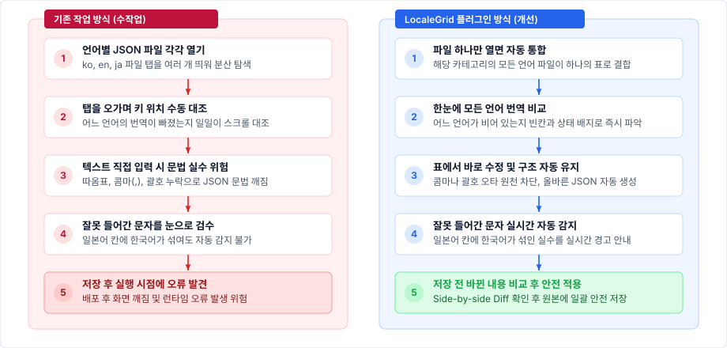

<details>
<summary>Mermaid 다이어그램 소스 보기</summary>

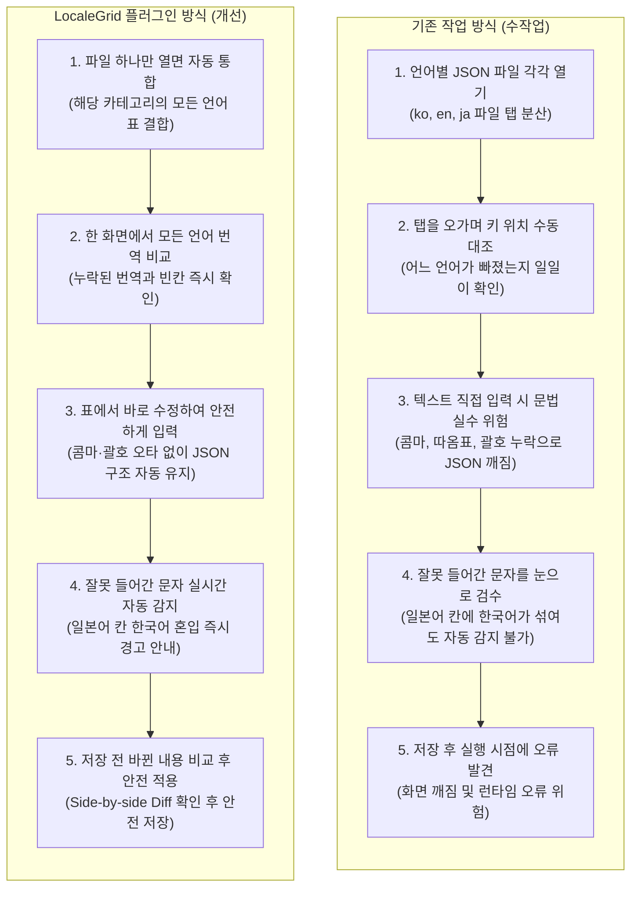
</details>

### 1.3 플러그인 핵심 기능
**LocaleGrid**는 복잡한 내부 기술을 몰라도 누구나 직관적으로 사용할 수 있도록 다음 6대 핵심 기능을 제공합니다:
1. **모든 언어를 한눈에 보는 통합 표**: 파일 하나만 열면 같은 카테고리의 모든 언어가 하나의 표에 열(Column) 단위로 자동 정렬되어, 누락되거나 비어 있는 번역을 한눈에 찾아 채워 넣을 수 있습니다.
2. **번역 실수와 누락 실시간 자동 감지**: 새로 추가된 키(초록), 수정된 값(파랑), 번역 누락(주황), 삭제 예정(회색), 구조 충돌(빨강)을 직관적인 색상 배지로 표시하며, 일본어 칸에 한국어가 잘못 섞여 들어가는 등의 실수를 실시간으로 짚어줍니다.
3. **간편한 검색과 키보드 양방향 탐색**: 단어 검색 시 일치하는 번역문이 실시간 하이라이트되며, 방향키(↑/↓)와 단축키(Enter/Shift+Enter, F3/Shift+F3)로 이전·다음 결과를 순환 탐색합니다. 주의가 필요한 경고/오류 행만 클릭 한 번으로 모아보고 마우스 드래그로 키의 표시 순서도 자유롭게 바꿀 수 있습니다.
4. **사내 AI 다국어 번역 제안**: 기존에 작성된 다른 언어 문맥을 참고하여 사내 로컬 LLM이 비어 있는 언어의 번역을 추천해 주며, 추천 칩을 클릭하거나 Enter/Space 키로 즉시 표에 적용하여 다국어 초안 작성 시간을 획기적으로 줄여줍니다.
5. **바뀐 내용만 미리 확인하고 안전하게 저장**: 저장을 누르면 어떤 파일의 어느 문장이 바뀌었는지 변경 전과 후를 나란히 비교해 보여주는 미리보기 화면을 제공하여 안전하게 저장할 수 있습니다.
6. **작업 목록을 엑셀로 바로 내보내기**: 현재 표에서 검색하거나 필터링한 번역 목록을 버튼 하나로 엑셀(`.xlsx`) 파일로 내려받아 번역팀이나 기획팀과 즉시 공유할 수 있습니다.

---

## 2. 시스템 아키텍처 및 핵심 도메인 모델

LocaleGrid는 계층화된 모듈 구조로 설계되어 플랫폼 통합, 코어 처리, 데이터 모델, 사용자 인터페이스가 유기적이면서도 독립적으로 동작하도록 구현되었습니다.

#### 계층형 시스템 아키텍처 다이어그램
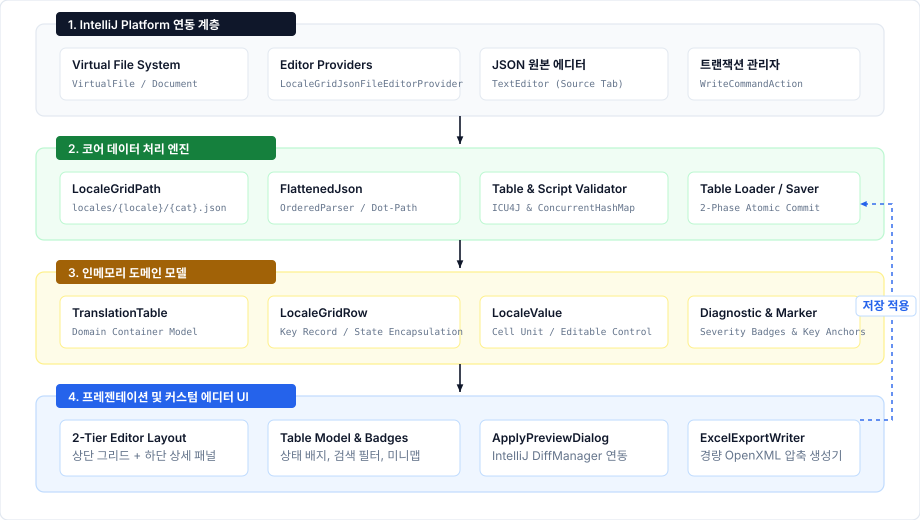

<details>
<summary>Mermaid 다이어그램 소스 보기</summary>

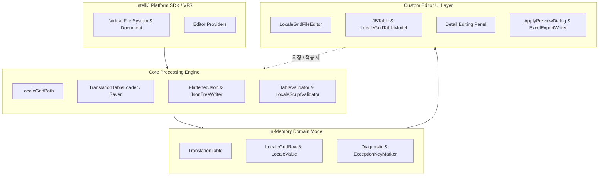
</details>

### 2.1 도메인 모델 설계

- **[`TranslationTable`](file:///Users/dave/Desktop/Workspace/LocaleGrid/src/main/java/com/localegrid/model/TranslationTable.java)**
  - 특정 카테고리(`category`)와 연결된 모든 언어 번역 데이터를 메모리 상에서 총괄 관리하는 최상위 모델입니다.
  - 행 목록(`List<LocaleGridRow>`), 로케일 목록(`List<String>`), 파일 매핑(`Map<String, File>`), 예외 키 마커(`Map<String, List<ExceptionKeyMarker>>`), 진단 정보(`List<Diagnostic>`) 및 키 순서 변경 플래그(`orderChanged`)를 종합적으로 관리합니다.
- **[`LocaleGridRow`](file:///Users/dave/Desktop/Workspace/LocaleGrid/src/main/java/com/localegrid/model/LocaleGridRow.java)**
  - 표의 한 행을 담당하는 번역 키 단위 모델입니다.
  - 원본 키와 변경된 키, 행 구분(일반 번역행 vs 예외 키행), 새로 추가되었거나 삭제 예정인 상태 정보를 안전하게 보관합니다.
  - `isModified()` 메서드를 통해 키 이름 수정, 행 삭제, 언어별 번역값 변경 여부를 즉시 계산하여 현재 상태를 정확히 판별합니다.
- **[`LocaleValue`](file:///Users/dave/Desktop/Workspace/LocaleGrid/src/main/java/com/localegrid/model/LocaleValue.java)**
  - 행 내에서 특정 언어 열(Column)에 대응하는 실제 번역 값 모델입니다.
  - 원본 값, 원본 파일 존재 여부, 수정 가능 여부, 변경 여부를 정밀하게 관리합니다.
  - 객체나 배열, 숫자 등 복잡한 비문자열 구조는 편집을 방지하여 원본 JSON 구조가 실수로 손상되는 것을 철저히 보호합니다.
- **[`Diagnostic`](file:///Users/dave/Desktop/Workspace/LocaleGrid/src/main/java/com/localegrid/model/Diagnostic.java)**
  - 문법 오류나 번역 누락 등을 사용자에게 알려주는 진단 알림 데이터 모델입니다.
  - 심각도(오류 `ERROR`, 경고 `WARNING`), 문제 발생 키, 해당 언어 정보를 포함하여 화면 안내 풍선말, 상태 배지, 저장 차단 기능과 연동됩니다.
- **[`ExceptionKeyMarker`](file:///Users/dave/Desktop/Workspace/LocaleGrid/src/main/java/com/localegrid/model/ExceptionKeyMarker.java)**
  - 번역 대상이 아닌 주석이나 섹션 구분용 예외 키(예: `__section__`, `__comment__`)의 원래 위치를 기억하고 보존하기 위한 위치 기억 모델입니다.
- **[`LocaleGridLlmClient`](file:///Users/dave/Desktop/Workspace/LocaleGrid/src/main/java/com/localegrid/llm/LocaleGridLlmClient.java)**
  - 사내 호스팅 Qwen, vLLM, Ollama 및 OpenAI 호환 LLM 엔드포인트와 비동기 통신하는 HTTP 통신 클라이언트입니다.
  - Java 11+ 내장 `HttpClient` 기반 비동기 Non-blocking 호출, 실시간 연결 테스트, 타임아웃 제어 및 응답 무결성 검증을 담당합니다.
- **[`TranslationSuggestionService`](file:///Users/dave/Desktop/Workspace/LocaleGrid/src/main/java/com/localegrid/llm/TranslationSuggestionService.java)**
  - 다국어 키와 기존 입력된 언어 문장을 문맥으로 종합하여 비어 있는 대상 언어의 번역을 LLM에 질의하고 추천하는 서비스입니다.
  - 정형 JSON 응답 유도 시스템 프롬프트 및 불필요한 추론(thinking) 출력 제어로 통신 지연 최소화 및 안정성을 확보합니다.
- **[`TranslationSuggestionChip`](file:///Users/dave/Desktop/Workspace/LocaleGrid/src/main/java/com/localegrid/editor/TranslationSuggestionChip.java)**
  - 비어 있는 번역 입력란에 보라색 별 아이콘과 추천 번역 문구를 표시하는 대화형 제안 칩 UI 컴포넌트입니다.
  - 마우스 원클릭 또는 Enter/Space 키 즉시 적용, 닫기 액션 분리, 가용 너비 맞춤 말줄임 및 전체 문구 툴팁을 제공합니다.

---

## 3. 주요 기능 소개

### 3.1 파일 탐색 및 듀얼 에디터 탭 제공
- **이중 파일 패턴 지원 ([`LocaleGridPath`](file:///Users/dave/Desktop/Workspace/LocaleGrid/src/main/java/com/localegrid/core/LocaleGridPath.java))**:
  - `locales/{locale}/{category}.json` 패턴과 `locales/{locale}/{category}_{locale}.json` 접미사 패턴을 모두 자동으로 인식합니다.
  - 열린 파일의 상위 경로를 자동으로 탐색하여 프로젝트 설정의 번역 폴더 위치와 일치하는지 확인합니다.
- **JSON 원본 탭과 다국어 에디터 탭 통합 ([`LocaleGridJsonFileEditorProvider`](file:///Users/dave/Desktop/Workspace/LocaleGrid/src/main/java/com/localegrid/editor/LocaleGridJsonFileEditorProvider.java))**:
  - 로케일 JSON 파일을 열면 기본 텍스트 에디터 대신 `JSON` 탭([`LocaleGridJsonSourceEditor`](file:///Users/dave/Desktop/Workspace/LocaleGrid/src/main/java/com/localegrid/editor/LocaleGridJsonSourceEditor.java))과 `다국어 에디터` 탭([`LocaleGridFileEditor`](file:///Users/dave/Desktop/Workspace/LocaleGrid/src/main/java/com/localegrid/editor/LocaleGridFileEditor.java))이 나란히 제공됩니다.

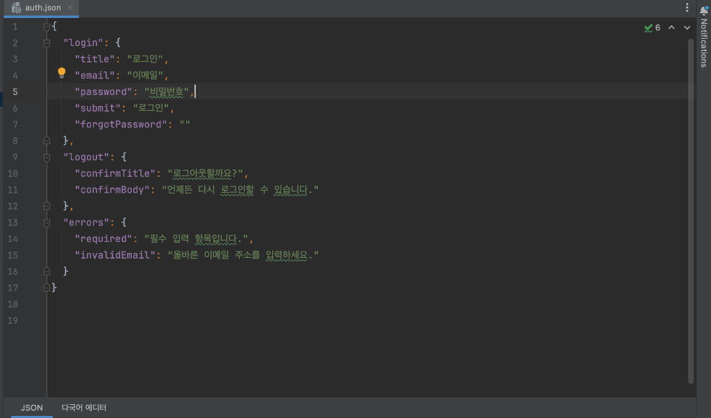

- **동기화 및 편집 상태 보존 정책**:
  - 다국어 에디터에서 값을 수정하기 전까지는 `JSON` 탭에서 소스를 직접 수정해도 다국어 에디터에 실시간으로 자동 반영됩니다.
  - 다국어 에디터에서 데이터 수정이 시작되면 탭 이름이 아래와 같이 `다국어 에디터 (편집중)`으로 변경되며 외부 파일 변경으로 작업 내용이 덮어씌워지지 않도록 안전한 편집 격리 모드로 전환됩니다.
  - 작업 중인 데이터는 사용자가 [적용]하거나 [취소]하기 전까지 안전하게 유지됩니다.


- **편집 중 탭 전환 보호 알림**:
  - 다국어 에디터에서 값을 수정한 상태(`편집중`)에서 원본 `JSON` 탭으로 전환을 시도할 경우, 저장되지 않은 변경 사항이 있음을 알리고 사용자의 확인을 거치도록 다이얼로그를 표시합니다.

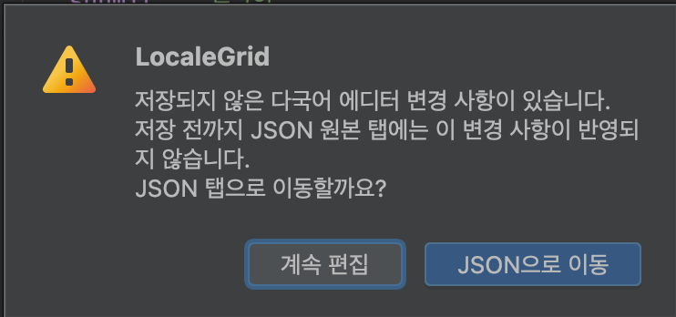

#### 편집 중인 작업 동기화 흐름 다이어그램
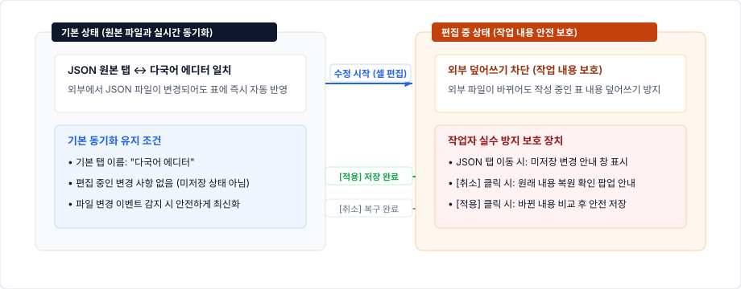

<details>
<summary>Mermaid 다이어그램 소스 보기</summary>

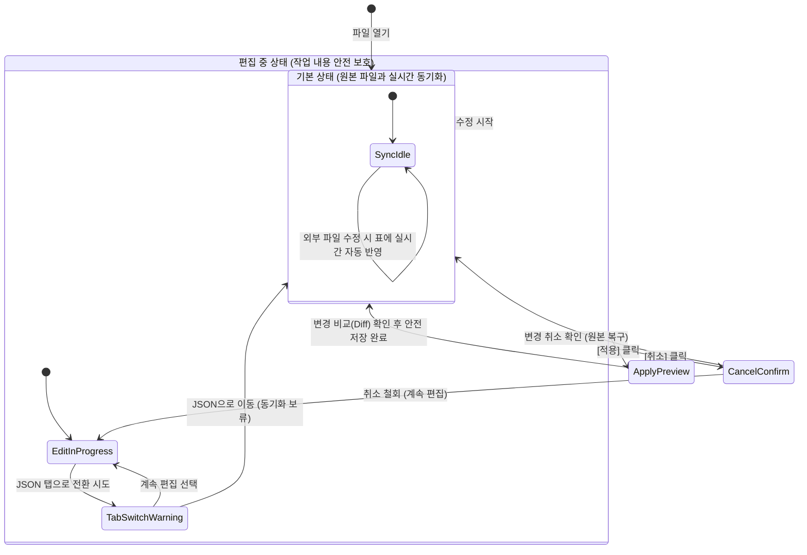
</details>

### 3.2 중첩 JSON 파일의 표 변환 및 원래 구조 복원
- **원본 키 작성 순서 100% 보존:** 원본 JSON 파일에 작성된 키의 순서를 그대로 기억하여 표에 정렬하며, 동일한 위치에 이름이 같은 중복 키가 있으면 다른 값으로 덮어쓰지 않고 즉시 오류로 감지하여 안전하게 보호합니다.
- **점(.) 표기를 통한 한 줄 키 변환:** 여러 겹으로 복잡하게 둘러싸인 중첩 구조(예: `login { password: ... }`)를 점으로 연결된 직관적인 한 줄 키(`login.password`)로 펼쳐, 표에서 모든 언어를 나란히 비교하고 편하게 편집할 수 있도록 변환합니다.
- **원래 중첩 구조로 안전한 복원:** 표에서 작업을 마치고 저장할 때는 점 표기를 다시 원래의 깔끔한 중첩 JSON 구조로 되돌리며, 표준 2칸 들여쓰기 서식과 예외 키의 원래 위치까지 완벽하게 복원합니다.

#### JSON 파일과 표(그리드) 간 양방향 데이터 변환 및 복원 흐름 다이어그램
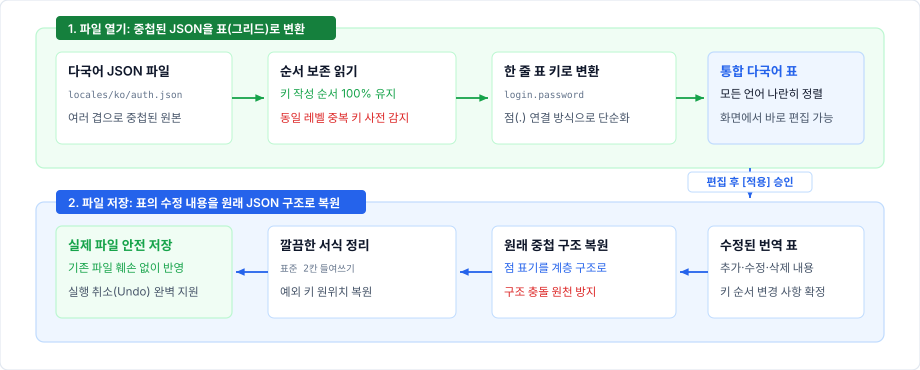

<details>
<summary>Mermaid 다이어그램 소스 보기</summary>

```mermaid
flowchart TD
    subgraph ReadPipeline ["1. 파일 열기: 중첩된 JSON을 표(그리드)로 변환"]
        direction TB
        JSON_File["원본 다국어 JSON 파일
(여러 겹으로 중첩된 구조)"] --> Parser["순서 보존 읽기
(키 순서 100% 유지)"]
        Parser --> DuplicateCheck{"동일 레벨 중복 키 감지"}
        DuplicateCheck -->|중복 발견| ErrorDiag["오류 감지 및 저장 차단"]
        DuplicateCheck -->|정상| Flatten["한 줄 표 키로 변환
(점 연결 방식: login.password)"]
        Flatten --> MemoryModel["통합 다국어 표
(화면에서 바로 편집 가능)"]
    end

    subgraph WritePipeline ["2. 파일 저장: 표의 수정 내용을 원래 JSON 구조로 복원"]
        direction TB
        EditedRows["수정된 번역 표
(추가·수정·삭제 내용 확정)"] --> TreeWriter["원래 중첩 구조 복원
(점 표기를 계층 구조로)"]
        TreeWriter --> TypeConflictCheck{"구조 충돌 여부 감지"}
        TypeConflictCheck -->|충돌| BlockSave["저장 차단 및 오류 안내"]
        TypeConflictCheck -->|정상| ReconstructedTree["깔끔한 서식 정리
(표준 2칸 들여쓰기)"]
        ReconstructedTree --> VFS_Save["실제 파일 안전 저장
(실행 취소 완벽 보존)"]
    end

    MemoryModel -->|사용자 편집 후 [적용] 승인| EditedRows
```
</details>

### 3.3 유니코드 스크립트 기반 다국어 문자 체계 검증
- **언어별 정밀 정책 정의 ([`LocaleScriptPolicy`](file:///Users/dave/Desktop/Workspace/LocaleGrid/src/main/java/com/localegrid/core/LocaleScriptPolicy.java))**:
  - `ko`: 한글(`HANGUL`), 라틴(`LATIN`) 허용
  - `en`: 라틴(`LATIN`) 허용
  - `ja`: 히라가나(`HIRAGANA`), 가타카나(`KATAKANA`), 한자(`HAN`), 라틴(`LATIN`) 허용
  - `vi`: 라틴(`LATIN`) 허용
- **CLDR likely-subtags 자동 추론**:
  - 러시아어, 아랍어, 태국어 등 기본 설정에 없는 언어도 세계 표준 언어 데이터(CLDR)를 바탕으로 사용할 문자 체계를 스스로 판별하여 지원합니다.
- **범용 예외 허용 및 이모지 보호**:
  - 공통 구두점/문장부호(`UnicodeScript.COMMON`), 결합 문자(`INHERITED`), 숫자(`\p{N}`), 유니코드 이모지 범위(`\x{1F000}-\\x{1FAFF}`)는 모든 언어에서 유효한 문자로 통과시킵니다.
- **고성능 캐싱 및 진단 엔진 ([`LocaleScriptValidator`](file:///Users/dave/Desktop/Workspace/LocaleGrid/src/main/java/com/localegrid/core/LocaleScriptValidator.java))**:
  - 문자 검사 규칙을 고속 메모리에 캐시하여 수천 개 단어도 끊김 없이 즉각 검사합니다.
  - 위반 문자 발생 시 `"허용되지 않은 문자: 안, 녕 (문자 체계: 한글)"` 형태의 명확한 요약 메시지를 실시간 생성합니다.

#### 유니코드 문자 체계 검증 엔진 처리 흐름도
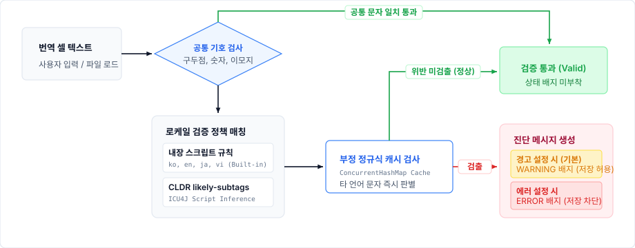

<details>
<summary>Mermaid 다이어그램 소스 보기</summary>

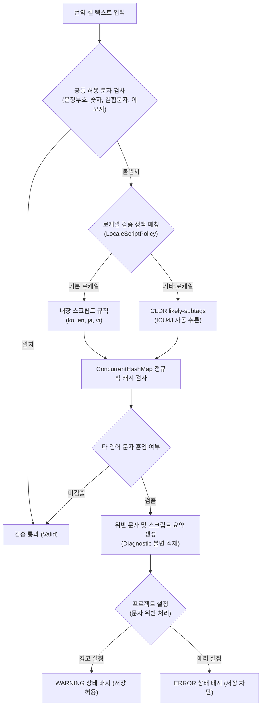
</details>

### 3.4 다국어 표 편집 화면 및 주요 작업 편의 기능
다국어 에디터는 모든 언어의 번역을 한눈에 보며 빠르게 작업하는 **상단 번역 표(그리드)**와, 긴 문장을 언어별로 차분히 다듬을 수 있는 **하단 상세 편집 창**으로 구성되어 작업 편의성을 극대화했습니다.

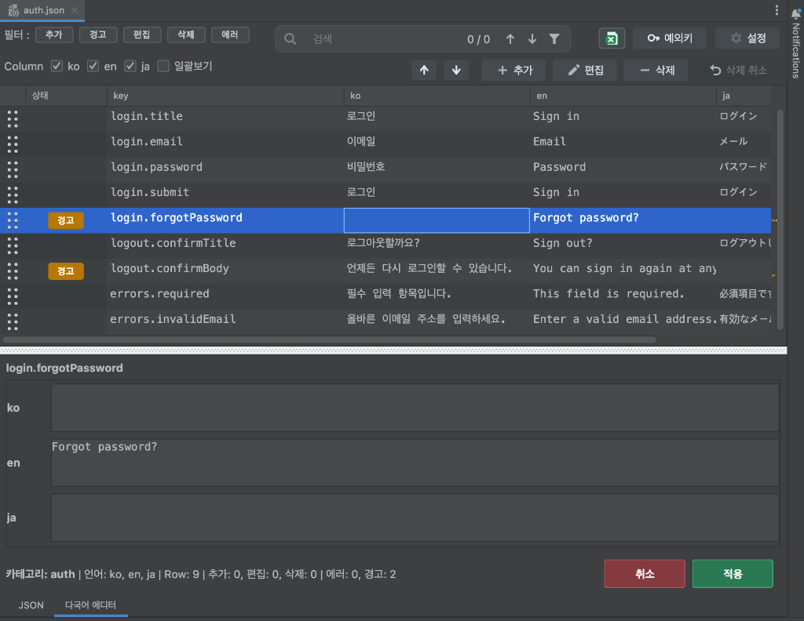

#### 1) 번역 상태 배지 안내
작업 중인 행의 상태와 검증 결과를 5가지 색상 배지로 표시하여 주의가 필요한 항목을 한눈에 알려줍니다.

| 배지 | 색상 | 상태 의미 및 발생 조건 | 저장 여부 | 동작 및 조치 방법 |
| :--- | :--- | :--- | :--- | :--- |
| **`추가`** | 초록색 | 툴바의 `[추가]` 버튼으로 새로 만든 번역 키 | 저장 대상 | 아직 파일에 반영되지 않은 새 항목입니다. 저장 시 각 언어 파일에 새 키로 추가됩니다. |
| **`편집`** | 파란색 | 키 이름을 바꾸거나 번역 셀 값을 수정한 항목 | 저장 대상 | 원본과 달라진 변경 사항이 있는 상태입니다. 저장 시 수정한 내용이 파일에 반영됩니다. |
| **`경고`** | 주황색 | 번역이 비어 있거나(빈칸) 다른 언어 문자가 섞인 항목 | **저장 가능** | 확인이 필요한 주의 상태입니다. 저장을 막지 않으므로 먼저 저장하고 나중에 채워 넣을 수 있습니다. |
| **`삭제`** | 회색 | 툴바의 `[삭제]` 버튼을 눌러 삭제 대기 중인 항목 | 저장 시 삭제 | 파일에서 바로 지우지 않고 대기 상태로 둡니다. 실수라면 `[삭제 취소]` 버튼으로 바로 복구할 수 있습니다. |
| **`에러`** | 빨간색 | 키 이름이 겹치거나 JSON 경로 충돌이 있는 항목 | **저장 차단** | 파일이 망가질 수 있는 오류입니다. 에러가 남아 있으면 저장이 차단되므로 키 이름을 바르게 고쳐야 합니다. |

- **여러 상태가 함께 발생할 때**: 새로 추가된 항목인데 번역이 비어 있다면 `[추가][경고]`가 함께 표시되는 것처럼, 해당하는 배지가 나란히 모두 표시되어 상태를 빠짐없이 알려줍니다. (삭제 대기 항목은 단일 `[삭제]` 배지로 우선 표시)

#### 2) 작업 편의 기능
- **원클릭 상태 모아보기 (5대 필터 토글 버튼):** 상단 툴바의 `추가`, `경고`, `편집`, `삭제`, `에러` 버튼을 클릭하여 원하는 상태의 행만 즉시 필터링하여 조회할 수 있습니다. 복수 선택이 가능하여 `[에러]`와 `[경고]` 행만 모아서 집중 점검할 수 있습니다.
- **실시간 단어 검색 및 키보드 양방향 탐색:** 검색창에 단어를 입력하면 500ms 디바운스를 적용하여 일치하는 번역문을 파란색 볼드로 실시간 강조합니다. 검색창에서 키보드 방향키(↑/↓)와 Enter / Shift+Enter를 누르거나, 테이블 포커스 상태에서 F3 / Shift+F3 키를 눌러 매칭 결과를 이전·다음으로 빠르게 순환 탐색할 수 있으며, 툴팁을 통해 직관적인 단축키 안내를 제공합니다.
- **드래그 앤 드롭 행 순서 변경:** 마우스로 좌측 핸들을 끌어당기거나 툴바의 이동 버튼(`▲`, `▼`)을 눌러 키의 순서를 자유롭게 바꿀 수 있습니다.
- **스크롤바 실시간 미니맵 바 (`StatusScrollMap`):** 수직 스크롤바 트랙 위에 에러(빨강), 경고(주황), 수정(파랑), 추가(초록) 위치를 작은 점(도트 마커)으로 표시하여, 수천 개 행 중에서도 클릭 한 번으로 문제 행을 찾아 이동할 수 있습니다.
- **하단 상세 입력 패널 및 AI 번역 연동:** 선택한 키의 언어별 번역문을 개별 입력 칸에서 넓고 여유롭게 편집할 수 있으며, 입력 오류 안내를 즉시 확인합니다. 참조할 언어 텍스트와 비어 있는 번역 대상 언어가 존재할 경우 키명 우측의 `[AI 번역 제안]` 버튼이 활성화되어 원클릭으로 추천 번역을 받아볼 수 있습니다.
- **특수문자 및 줄바꿈 보존:** 줄바꿈(`
`)이나 탭(`	`) 같은 특수문자를 셀 안에서 보기 쉬운 기호로 안전하게 유지하여 표 모양이 깨지지 않습니다.

**변경 취소 안전 확인:**  
에디터 하단의 `[취소]` 버튼을 클릭할 때 저장되지 않은 변경 사항이 존재하면, 원본 상태로 복구하기 전 사용자 확인을 거쳐 작업 데이터가 실수로 유실되는 것을 방지합니다.

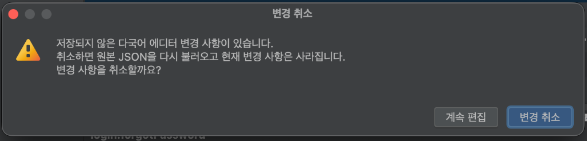

### 3.5 변경 내용 미리보기 및 안전한 저장 흐름 ([`ApplyPreviewDialog`](file:///Users/dave/Desktop/Workspace/LocaleGrid/src/main/java/com/localegrid/editor/LocaleGridFileEditor.java))
단 한 번의 잘못된 클릭이나 실수로 기존 번역 파일이 손상되는 일이 없도록, 저장 전 오류 자동 점검과 변경 전·후 비교(미리보기) 화면을 거치는 2중 안전장치를 제공합니다.

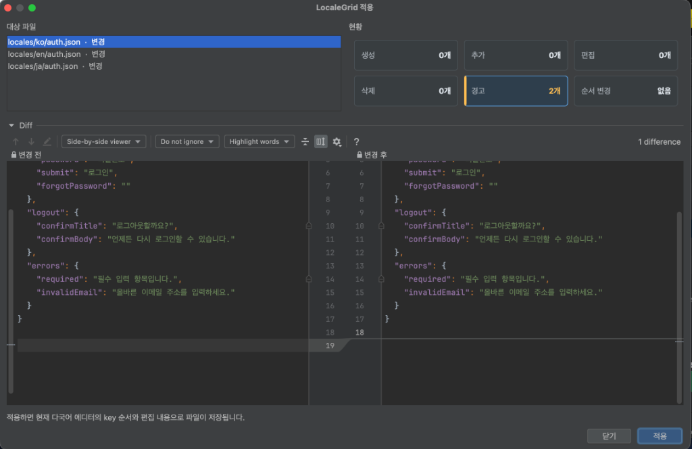

1. **오류 자동 점검**: 저장을 진행하기 전, 중복된 키나 문법 오류가 없는지 시스템이 스스로 먼저 점검하여 파일이 손상되는 것을 원천 차단합니다.
2. **변경 수량 요약**: 어떤 언어 파일에서 몇 개의 키가 새로 추가되었고, 수정되거나 삭제되었는지 숫자로 한눈에 알기 쉽게 정리합니다.
3. **비교 화면 미리보기**: 이전 원본 내용과 새로 바뀐 내용을 좌우로 나란히 대조해 보여주어, 의도치 않은 실수가 없는지 눈으로 직접 확인합니다.
4. **안전한 파일 저장**: 최종 승인을 받으면 실제 파일에 안전하게 반영하며, 작업 후에도 언제든 이전 상태로 되돌릴 수 있도록 실행 취소(Undo) 히스토리를 완벽히 보존합니다.

#### 변경 내용 미리보기 및 안전한 저장 흐름 다이어그램
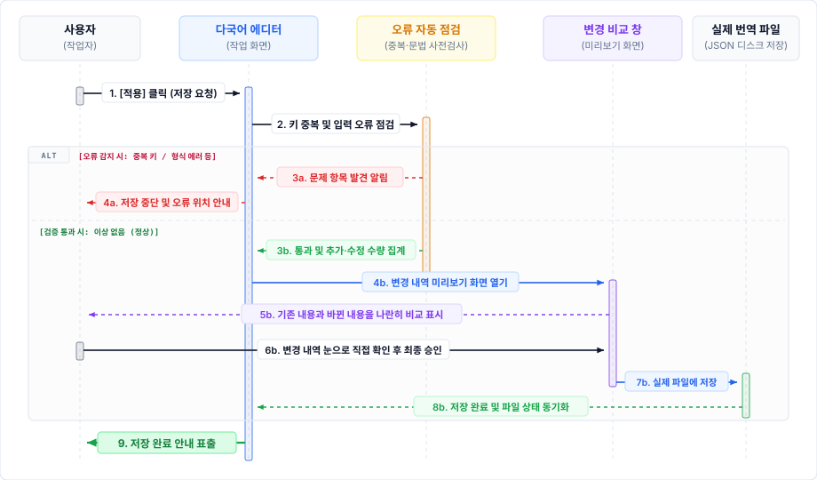

<details>
<summary>Mermaid 다이어그램 소스 보기</summary>

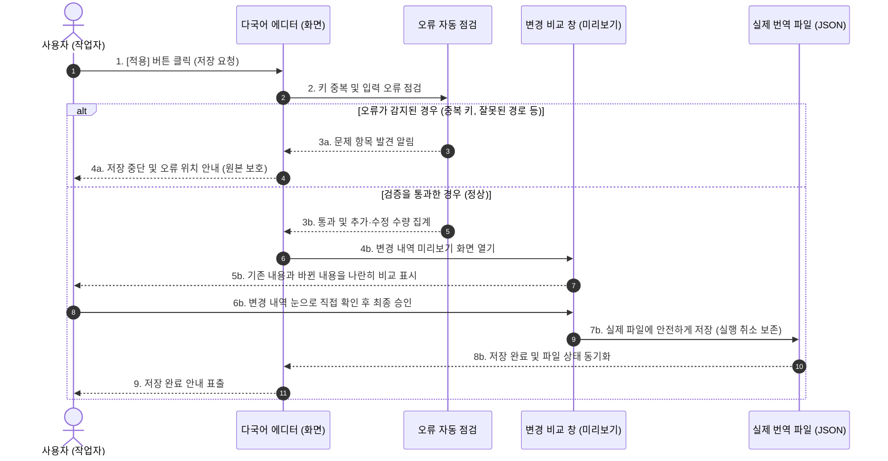
</details>

### 3.6 필터링된 내용 엑셀 다운로드 ([`ExcelExportWriter`](file:///Users/dave/Desktop/Workspace/LocaleGrid/src/main/java/com/localegrid/editor/ExcelExportWriter.java))
- **전문 번역인 협업 및 검수 효율화:**
  - 실제 프로젝트 진행 중 외부 전문 번역인이나 사내 감수자에게 특정 화면이나 새로 추가된 번역 키만 전달하여 검수를 요청해야 할 때가 있습니다.
  - 이전에는 개발자가 복잡한 JSON 파일에서 대상 키를 일일이 찾아 복사·붙여넣기하며 수작업으로 엑셀을 만들어야 하는 번거로움과 누락 실수가 잦았습니다.
  - LocaleGrid에서는 이러한 불편을 해소하기 위해 **원하는 검색어, 카테고리 또는 상태(신규 추가, 미번역, 경고 등)로 필터링된 내용만 즉시 엑셀(`.xlsx`) 파일로 다운로드**할 수 있도록 구현했습니다. 전문 번역인은 복잡한 개발 도구나 JSON 파일 구조를 알 필요 없이 친숙한 엑셀 환경에서 편안하게 번역을 검수할 수 있습니다.
- **전문 서식 자동 적용:** 첫 행 헤더 틀 고정, 전체 컬럼 자동 필터, 텍스트 줄바꿈 서식, 최적 컬럼 너비가 자동으로 적용되어 즉시 전달할 수 있습니다.
- **초경량 무의존 고속 생성:** 외부 무거운 라이브러리 없이 순수 Java `ZipOutputStream`과 OpenXML 표준 규격을 직접 구현하여 수천 개 행도 1초 미만에 가볍고 빠르게 다운로드합니다.
- **원클릭 완료 액션:** 다운로드가 끝나면 바로 확인할 수 있도록 "파일 열기", "폴더 열기" 바로가기 창을 제공합니다.

### 3.7 예외 키 보호 및 프로젝트 맞춤 환경 설정
- **번역 제외 키(예외 키) 안전 보호 ([`ExceptionKeyMarker`](file:///Users/dave/Desktop/Workspace/LocaleGrid/src/main/java/com/localegrid/model/ExceptionKeyMarker.java))**:
  - 에디터 상단의 `예외키` 버튼을 통해 번역할 필요가 없는 주석이나 섹션 구분용 예외 키(예: `__section__`, `__comment__`)를 지정할 수 있습니다.
  - 지정된 예외 키는 번역 표에서 숨겨져 작업자가 번역에만 집중할 수 있게 도우며, 파일을 저장할 때는 원래 있던 자리 그대로 안전하게 보존되어 파일 구조가 깨지지 않습니다.

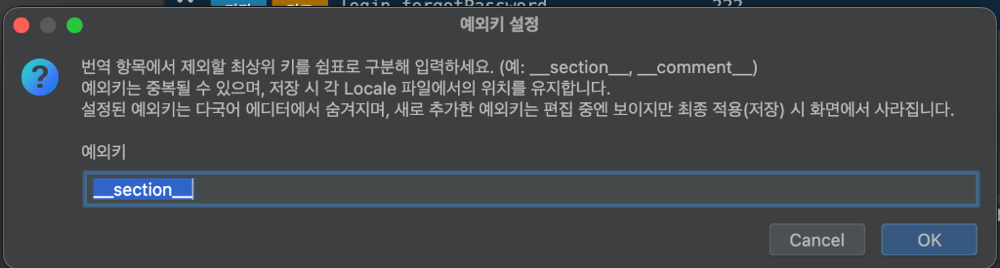

- **프로젝트 맞춤 환경 설정 ([`LocaleGridSettingsConfigurable`](file:///Users/dave/Desktop/Workspace/LocaleGrid/src/main/java/com/localegrid/settings/LocaleGridSettingsConfigurable.java))**:
  - IntelliJ 환경 설정(`Settings > Tools > LocaleGrid`)에서 팀의 개발 규칙과 작업 편의에 맞춰 옵션을 자유롭게 설정할 수 있습니다.
  - **기본 설정:** 다국어 번역 파일이 모여 있는 폴더 위치(기본 `locales`)와, 표에 나열할 언어 순서(예: `ko, en, ja, vi`)를 지정합니다.
  - **상세 설정:** 번역 제외 키 목록, 저장 시 들여쓰기 공백 크기(2칸 또는 4칸), 타 언어 문자 감지 사용 여부 및 위반 시 알림 수준(경고 표시 또는 저장 차단)을 유연하게 조정할 수 있습니다.
  - **사내 AI 번역 제안 (LLM 연동) 설정:** 사내 서빙 인스턴스(Qwen, DeepSeek, Llama 등) 및 OpenAI 호환 엔드포인트 URL, 모델 식별자, API Key, 타임아웃(초)을 설정하며, `[연결 테스트]` 버튼으로 실시간 통신 상태와 응답 속도를 즉시 점검할 수 있습니다.
  - **작업 데이터 안전 보호:** 표에서 편집 중인 내용이 남아 있을 때는 작업 중인 데이터가 꼬이는 것을 막기 위해 환경 설정 변경을 안전하게 제한합니다.

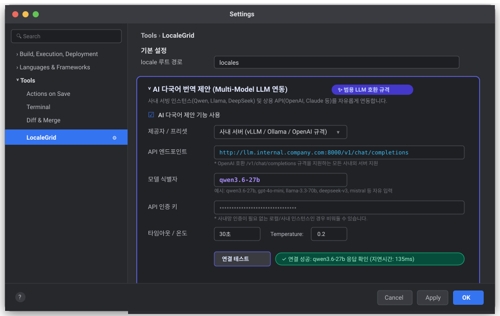

### 3.8 사내 AI 다국어 번역 제안 (LLM 연동)
- **사내 로컬 LLM 연동 및 사내 보안 유지:**
  - 사내 폐쇄망 환경에서 자체 호스팅 중인 로컬 LLM(Qwen, DeepSeek, Llama 등) 및 OpenAI 호환 규격의 엔드포인트와 연동하여, 다국어 리소스가 외부 클라우드로 유출될 걱정 없이 안전하게 다국어 번역 초안을 작성할 수 있습니다.
- **지능형 활성화 조건 및 작업 상태 분리:**
  - 하단 상세 패널 키명 우측의 `[AI 번역 제안]` 버튼은 기준이 되는 참조 언어(한국어, 영어 등)가 1개 이상 존재하고, 비어 있는 번역 대상 언어가 있을 때만 활성화됩니다. 모든 언어가 이미 입력되어 있으면 불필요한 요청을 방지하기 위해 버튼이 자동으로 비활성화됩니다.
  - AI 요청 진행 상태(전송 중, 성공, 실패 알림)는 버튼 바로 오른쪽에 동일한 글꼴 크기로 간결하게 표시되며, 기존 하단 상태바의 정보(카테고리, 전체 행 수, 편집/오류/경고 카운트)를 손상시키지 않고 그대로 보존합니다.
- **대화형 추천 번역 칩 ([`TranslationSuggestionChip`](file:///Users/dave/Desktop/Workspace/LocaleGrid/src/main/java/com/localegrid/editor/TranslationSuggestionChip.java)):**
  - **원클릭 즉시 적용:** 추천 문구는 작은 보라색 별 아이콘이 달린 칩 형태로 표시되며, 마우스 클릭 한 번 또는 키보드 포커스 상태에서 `Enter` / `Space` 키를 눌러 입력란에 즉시 반영할 수 있습니다. 적용 시 해당 행은 일반 `[편집]` 상태로 전환되어 안전한 저장 파이프라인으로 연결됩니다.
  - **닫기 액션 분리:** 칩 우측의 닫기(`×`) 버튼을 클릭하면 추천 문구를 반영하지 않고 제안 칩만 깔끔하게 제거합니다.
  - **반응형 너비 및 전체 문구 툴팁:** 칩은 추천 문구의 길이에 맞추어 유연하게 너비를 조정하며, 가용 너비를 초과하는 긴 문구는 자동으로 한 줄 말줄임(ellipsis) 처리되고 마우스 호버 시 툴팁을 통해 전체 원문을 온전하게 확인할 수 있습니다.
- **사내 모델 최적화 및 견고한 오류 제어:**
  - Qwen 등 사내 추론 모델에서 발생할 수 있는 불필요한 생각(thinking) 출력을 비활성화하고, 엄격한 JSON 구조 응답을 유도하는 맞춤형 프롬프트를 적용했습니다. 지원하지 않는 파라미터는 자동으로 호환 처리하며, 응답 잘림 현상을 진단하여 실패 시 명확한 원인을 안내합니다.

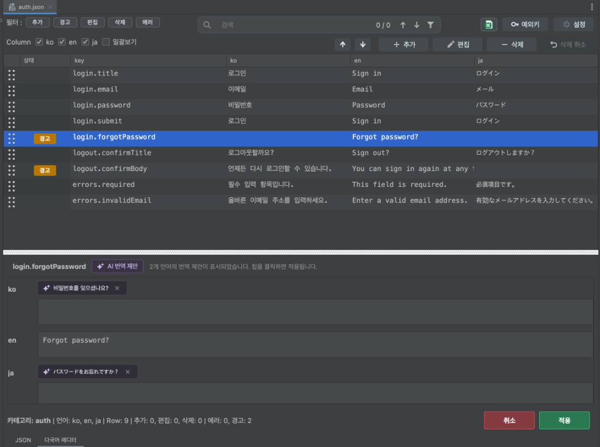

---

## 4. 기술적 차별점 및 주요 개선 사항

| 비교 항목 | 기존 수작업 / 텍스트 편집 | LocaleGrid 도입 후 | 주요 개선 사항 |
| :--- | :--- | :--- | :--- |
| **다국어 파일 관리** | 언어별 파일 탭을 각각 열고 키를 수동 검색하여 비교 | 선택된 파일 기준 단일 데이터 테이블로 통합 비교·편집 | 작업 시간 단축 및 번역 누락 식별성 극대화 |
| **JSON 구문 무결성** | 콤마, 따옴표 오탈자, 중괄호 불일치 발생 위험 | 자동 들여쓰기 및 올바른 JSON 구조 자동 유지로 구문 오류 사전 차단 | 구문 오류 발생 위험 원천 제거 |
| **문자 체계 적합성** | 타 언어 문자 혼입을 개발 시점에 인지하기 어려움 | ICU4J/CLDR 기반 유니코드 스크립트 실시간 감지 및 안내 | 타 언어 오기입 사전 확인 100% |
| **저장 안정성** | 저장 시 즉시 덮어쓰기되어 실수 복구 어려움 | 변경 수량 요약 및 미리보기 화면 확인 후 안전 저장 | 데이터 유실 및 덮어쓰기 실수 방지 |
| **엑셀 내보내기** | 수작업 복사 또는 별도 프로그램 필요 | 현재 필터링된 내용 기반 원클릭 엑셀(.xlsx) 파일 생성 | 외부 협업용 데이터 추출 간소화 |
| **UI 반응성** | 수천 줄 편집 시 에디터 렌더링 지연 발생 가능 | 입력 최적화(디바운스) 적용으로 대용량 데이터도 버벅임 없는 반응성 유지 | 쾌적한 편집 반응성 유지 |
| **AI 다국어 번역 지원** | 번역가 전달 전 빈 언어 초안 작성 시 외부 번역기 수동 복사·붙여넣기 반복 | 사내 로컬 LLM 기반 기존 언어 문맥 자동 참조 및 원클릭 추천 칩 적용 | 다국어 초안 작성 속도 대폭 향상 |

> **품질 검증 상태:**  
> 본 프로젝트는 프로덕션 코드 40개 파일과 21개 테스트 클래스(총 117개 자동화 테스트 케이스)를 구축하여 검증을 완료했습니다. JSON 표 변환 및 원본 복원, 문자 체계 검증, 엑셀 내보내기 포맷, 사내 LLM 비동기 통신 및 검색창·테이블 키보드 양방향 순환 탐색이 자동화 테스트로 철저히 검증됩니다.

---

## 5. 결론 및 기대 효과

**LocaleGrid**는 다국어 리소스 관리 과정에서 반복적으로 발생하던 다중 파일 대조의 번거로움, 계층 구조 훼손 위험, 타 언어 문자 혼입 문제를 해결하기 위해 구현된 개발 도구입니다.

- 선택한 다국어 파일을 기준으로 모든 언어를 하나의 표에서 한눈에 비교하고 바로 수정할 수 있는 직관적인 작업 환경을 제공합니다.
- 다국어 문자 체계 검증과 안전한 원래 구조 복원을 통해 번역 데이터의 정확성과 구조적 안정성을 보장합니다.
- 직관적인 색상 배지, 키보드 순환 탐색과 실시간 검색 강조, 스크롤 미니맵, 사내 AI 다국어 번역 제안, 저장 전 변경 내용 미리보기를 통해 작업 중 발생할 수 있는 실수와 누락을 사전에 효과적으로 예방합니다.

본 플러그인을 통해 다국어 리소스 관리 작업의 편의성과 품질을 한층 높일 수 있으며, 다국어 편집 환경에서 발생할 수 있는 번역 누락과 구조적 오류를 예방하여 높은 작업 효율과 안정성을 기대할 수 있습니다.
