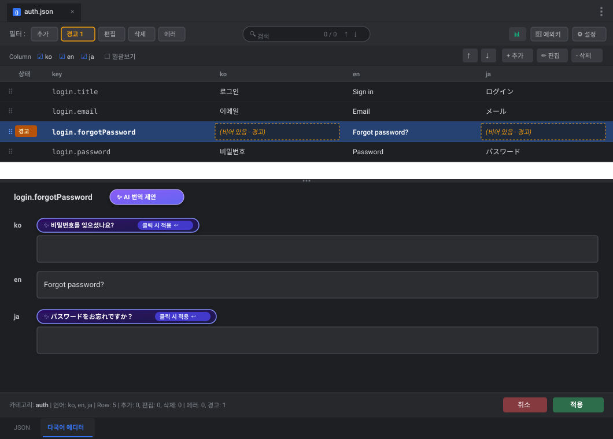

# LocaleGrid LLM 다국어 제안 기능 설계서 (다중 모델 및 Qwen 3.6-27B 지원)

- **작성일**: 2026-09-05
- **지원 모델**: 범용 OpenAI API 호환 LLM (사내 `qwen3.6-27b`, `deepseek-v3`, `llama-3.3`, 상용 `gpt-4o-mini` 등 자유 연동)
- **문서 목적**: 사내 호스팅 모델(Qwen 등) 및 다양한 LLM을 유연하게 교체하며 LocaleGrid 내에서 다국어 번역을 자동으로 추천·제안받을 수 있는 아키텍처 및 UI/UX 구현 설계

---

## 1. 개요 및 구현 가능 여부

### 1.1 다중 모델(Multi-Model) 확장 지원 가능 여부: **완전 구현 가능 (High Feasibility)**
- **업계 표준 규격 (OpenAI API 호환)**: 현재 사내 서빙 도구(vLLM, Ollama, LiteLLM, TGI, LocalAI)와 상용 API(OpenAI, Groq, Mistral 등)의 99%는 표준 **OpenAI Chat Completions API (`/v1/chat/completions`)** 규격을 공통으로 사용합니다.
- **자유로운 모델 교체 (Plug & Play)**: 플러그인의 통신 모듈을 특정 모델에 종속시키지 않고 범용 OpenAI 호환 클라이언트로 추상화함으로써, **엔드포인트 URL과 모델 식별자(Model ID)만 변경하면 어떤 사내외 모델이든 코드 수정 없이 즉시 연동**할 수 있습니다.
- **경량 런타임**: IntelliJ 플랫폼 및 Java 17 내장 `java.net.http.HttpClient`를 활용하여 외부 라이브러리 추가 없이 가볍고 안전하게 비동기 통신을 처리합니다.

---

## 2. 시스템 아키텍처

```
┌─────────────────────────────────────────────────────────────┐
│                       IntelliJ IDE                          │
│                                                             │
│  [LocaleGrid Settings] ────> Endpoint, Model, API Key, Prompt│
│          │                   (Qwen / DeepSeek / Llama / GPT)│
│          ▼                                                  │
│  [LocaleGridFileEditor]                                     │
│     └── Detail Panel: [✨ AI 번역 제안] ──> [추천 칩(Chip) UI]│
│          │                                                  │
│          ▼ (Background Task with Progress)                  │
│  [TranslationSuggestionService]                             │
│     ├── Multi-reference Context Builder (입력된 모든 언어)  │
│     └── Response Parser (JSON structured parsing)          │
│          │                                                  │
│          ▼ (java.net.http.HttpClient)                       │
└──────────┼──────────────────────────────────────────────────┘
           │ HTTP POST /v1/chat/completions (JSON)
           ▼
┌─────────────────────────────────────────────────────────────┐
│    사내/외 LLM 서빙 인프라 (OpenAI API 호환 규격 지원)     │
│    ├── 사내 호스팅: Qwen 3.6-27B, DeepSeek-V3, Llama 3.3   │
│    ├── 로컬 서빙: Ollama, vLLM, LiteLLM, LocalAI           │
│    └── 상용 API: OpenAI (GPT-4o), Claude (via 프록시) 등   │
└─────────────────────────────────────────────────────────────┘
```

---

## 3. 핵심 컴포넌트 설계

### 3.1 설정 관리 (`LocaleGridSettingsState`)
사용자가 사내 모델(Qwen 등) 또는 외부 모델을 자유롭게 등록·전환할 수 있도록 유연한 구조로 설계합니다.

- **설정 항목**:
  - `llmEnabled` (boolean): AI 다국어 제안 기능 활성화 여부
  - `llmProviderPreset` (String): 제공자 프리셋 (`사내 vLLM/Ollama`, `OpenAI`, `사용자 정의` 등)
  - `llmApiEndpoint` (String): 서빙 주소 (예: `http://llm.internal.company.com:8000/v1/chat/completions`)
  - `llmApiKey` (String): 인증 토큰 (사내망 무인증인 경우 공백 허용)
  - `llmModelName` (String): 모델 식별자 (기본값: `qwen3.6-27b`, `gpt-4o-mini`, `deepseek-v3`, `llama-3.3-70b` 등 자유 입력)
  - `llmTimeoutSeconds` (int): 요청 타임아웃 (기본 30초)
  - `llmTemperature` (double): 생성 다양성 조절 (번역 일관성을 위해 기본 0.2 권장)

### 3.2 통신 클라이언트 (`LocaleGridLlmClient`)
- `java.net.http.HttpClient` 기반 비동기 Non-blocking 통신.
- 표준 OpenAI 포맷 지원:
  ```json
  {
    "model": "qwen3.6-27b",
    "messages": [
      {"role": "system", "content": "시스템 프롬프트..."},
      {"role": "user", "content": "요청 프롬프트..."}
    ],
    "temperature": 0.2,
    "response_format": {"type": "json_object"}
  }
  ```
- SSE(Streaming) 방식 대신 배치/단건 JSON 완료 응답 구조를 사용하여 파싱 단순화 및 안정성 확보.

### 3.3 프롬프트 빌더 및 다중 언어 문맥 주입 (`LlmPromptBuilder`)
단순 텍스트 번역기가 아닌 **UI 소프트웨어 다국어 번역**에 최적화된 프롬프트 설계:

1. **다중 언어 문맥(Multi-reference Context) 전달 [핵심]**:
   - 현재 행의 하단 패널에 이미 입력되어 있는 모든 언어(예: ko, en 등)의 문장을 AI에게 함께 전달합니다.
   - **효과**: 단어의 의미 다의성(Disambiguation)을 명확히 해소하고, 복수 언어의 문장 구조를 교차 참조하여 번역 정확도와 어순 최적화가 극대화됩니다.
2. **키(Key) 및 카테고리 문맥 제공**:
   - 예: `category: auth`, `key: login.forgotPassword`
   - 모델이 버튼 문구인지, 링크인지, 에러 메시지인지 맥락을 이해하고 적절한 어조를 유지합니다.
3. **변수 및 특수 기호 불변 규칙(Strict Invariant)**:
   - `{0}`, `{count}`, `%s`, `\n`, HTML 태그(`<br/>`, `<b>` 등)가 변경되거나 번역되지 않도록 규칙 명시.
4. **Structured JSON Output 요청**:
   - 번역 대상 언어(Target Locales)를 Key-Value 형식으로 안전하게 수신.

**프롬프트 예시**:
```text
[System]
당신은 소프트웨어 UI 로컬라이제이션 전문가입니다.
제공된 Key 이름과 기존에 입력된 언어별 번역문(References)을 모두 교차 분석하여, 대상 언어(Target Locales)로 가장 자연스럽고 일관된 번역을 제안하십시오.

규칙:
1. {0}, {count}, %s 등의 변수와 HTML 태그, 이스케이프 문자(\n)는 절대 수정하거나 번역하지 말고 원형 그대로 보존하십시오.
2. 버튼/라벨/메시지의 UI 특성에 맞춰 간결하고 자연스러운 표현을 사용하십시오.
3. 반드시 다음 JSON 형식으로만 응답하십시오:
{
  "translations": {
    "ko": "추천 번역문...",
    "ja": "추천 번역문..."
  }
}

[User]
- 카테고리: auth
- 키: login.forgotPassword
- 기존 입력 번역문:
  - en: "Forgot password?"
- 번역 대상 언어: ["ko", "ja"]
```

---

## 4. UI/UX 연동 설계 및 화면 시뮬레이션

### 4.1 다국어 에디터 메인 화면 목업 (칩 형태 추천 UI)
선택된 행의 누락된 언어에 대해 추천 번역을 칩(Chip) 형태로 제안받아 클릭으로 적용하는 UI입니다.



- **키명 옆 `[✨ AI 번역 제안]` 버튼**:
  - 하단 상세 패널 상단 Key 이름(`login.forgotPassword`) 바로 옆에 버튼이 위치합니다.
  - 클릭 시 버튼에 로딩 스피너가 돌며(`[⏳ 번역 제안 생성 중...]`), 현재 입력된 모든 언어 문장을 Qwen에 전달합니다.
- **칩(Chip) 형태의 추천 및 선택적 적용**:
  - 생성이 완료되면 비어 있는 언어 필드(`ko`, `ja`) 상단에 `✨ 비밀번호를 잊으셨나요? [클릭 시 적용 ↵]` 칩이 나타납니다.
  - 사용자가 **칩을 클릭하면 해당 언어 입력창에 문구가 즉시 쏙 들어가며 칩은 사라집니다**.
  - 원치 않는 추천일 경우 칩을 무시하거나 직접 타이핑할 수 있어 강제 덮어쓰기 위험이 없습니다.
- **깔끔한 현황 관리 (AI 수식어 배제)**:
  - 추천을 적용하더라도 상태바나 테이블에 별도로 'AI 제안됨' 같은 표현을 붙이지 않고, 일반적인 **'편집'** 상태로만 산뜻하게 표시됩니다.
  - 상단 툴바는 기존의 깔끔한 3개 버튼(`Excel`, `예외키`, `설정`)을 그대로 유지합니다.

### 4.2 IDE 설정 화면 목업
사내 LLM 엔드포인트 URL과 모델명을 설정하고 연결을 즉시 검증하는 화면입니다.


- `Settings > Tools > LocaleGrid`의 `사내 LLM 번역 제안 (Qwen 3.6-27B)` 섹션
- OpenAI 규격 엔드포인트(`http://llm.internal.company.com:8000/v1/chat/completions`), 모델 식별자(`qwen3.6-27b`), API 키 입력
- `[연결 테스트]` 버튼으로 응답 지연 시간(Latency)과 정상 통신 여부를 즉시 시각적으로 확인

---

## 5. 예외 및 품질 관리 방안

1. **타임아웃 및 사내망 단절 대응**:
   - 요청 타임아웃(예: 30초) 발생 시 UI 동결 없이 오류 알림(Notification) 및 재시도 안내.
2. **문자 체계 검증기(`LocaleScriptValidator`) 연계**:
   - LLM이 제안한 번역값이 대상 언어(ja, vi 등)의 문자 체계 규칙을 준수하는지 기존 검증 파이프라인에서 자동 교차 검증.
3. **포맷/플레이스홀더 검증**:
   - 원본에 있던 `{0}` 등이 제안 결과에 누락되었을 경우 경고 표시.
4. **EDT(UI 스레드) 격리**:
   - 모든 네트워크 통신 및 파싱은 백그라운드 스레드에서 수행하고, UI 반영만 `SwingUtilities.invokeLater`로 전달.

---

## 6. 단계별 구현 계획

| 단계 | 작업 내용 | 세부 항목 |
| --- | --- | --- |
| **1단계** | 설정 UI 및 통신 모듈 구축 | - `LocaleGridSettingsState`에 LLM 엔드포인트/모델 설정 추가<br>- IDE 설정 화면에 테스트 연결(Test Connection) 버튼 제공<br>- OpenAI 규격 기반 `LocaleGridLlmClient` 구현 |
| **2단계** | 단일 필드/행 AI 제안 기능 | - `TranslationSuggestionService` 및 프롬프트 생성기 구현<br>- 상세 패널(Detail Panel)에 `✨ AI 제안` 버튼 배치<br>- 값 채우기 및 Undo/Redo 연동 |
| **3단계** | 일괄 번역 제안 및 안전 장치 | - 다중 Row 일괄 번역 Background Task 구현<br>- 플레이스홀더 누락 검증 및 문자 체계 자동 진단 연동<br>- 단위 테스트 및 E2E Mock 테스트 작성 |
