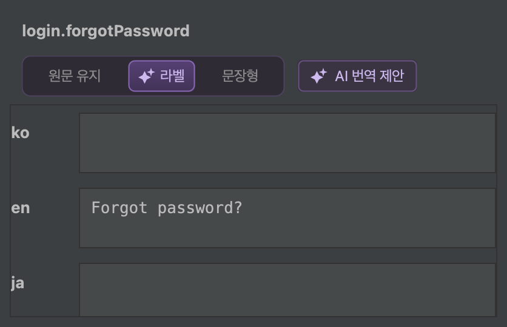
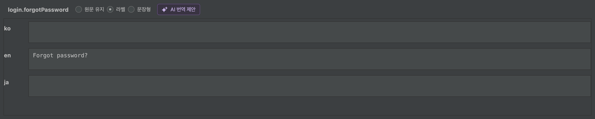
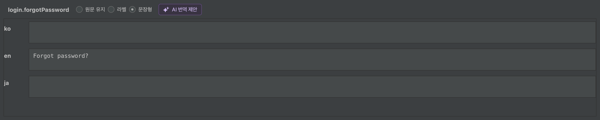
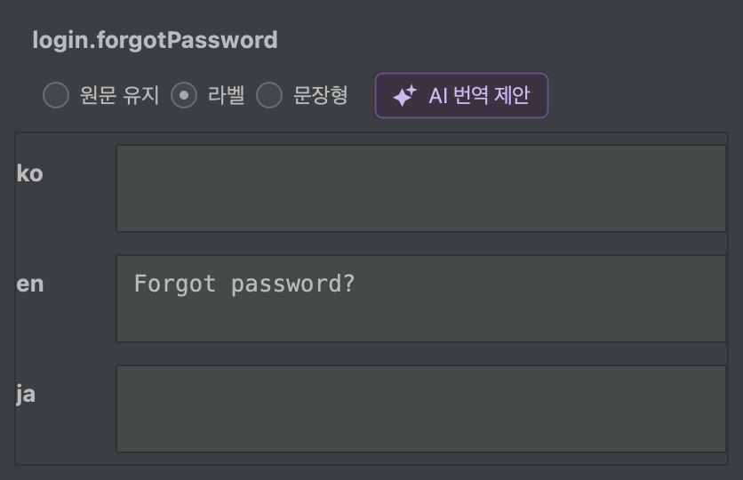

# AI 번역 스타일 구현 및 화면 검증

`자동`·`라벨형`·`문장형` 선택을 구현하고 개발 PyCharm에서 화면을 확인했습니다. 0.16.0 릴리즈 대상 기능입니다. 화면 파일명의 v0.15.0은 버전 상향 전 개발 IDE에서 캡처한 시점을 나타냅니다.

| 선택 | 동작 |
| --- | --- |
| 자동 | 기본값. 원문의 표현 형태에 맞춰 번역 |
| 라벨형 | 버튼·메뉴·항목명에 적합한 표현. 길이 제한과 의미 축약 없음 |
| 문장형 | 불필요한 설명을 추가하지 않는 자연스러운 완결 문장 |

선택은 현재 에디터에 유지하며 에디터를 다시 열면 기본값으로 시작합니다. 기능 비활성화 시 선택을 숨기고, 요청 중에는 선택과 제안 버튼을 비활성화합니다. 결과 안내는 AI 버튼과 스타일 옵션을 묶은 영역 오른쪽에 표시합니다.

## 검증 결과

- 전체 123개 테스트 통과: 실패·오류·건너뜀 0개.
- 플러그인 ZIP 빌드, ZIP 무결성, TranslationStyle 클래스 포함 확인.
- 테스트용 클라이언트로 선택한 스타일이 실제 서비스 요청의 시스템 프롬프트에 전달되는지 검증.
- 실행 중인 개발 PyCharm에서 세 스타일 버튼의 상호 배타 선택과 활성 상태 확인.
- 1400px IDE 창과 460px 좁은 IDE 창에서 상세 패널 확인. 좁은 창에서는 키명을 윗줄로 배치하여 선택과 버튼이 겹치지 않음.
- README, PLAN, IMPLEMENTATION_PLAN의 Markdown·HTML 갱신.

## 최종 일체형 UI

표시는 `자동 · 라벨형 · 문장형`으로 통일했습니다. 자동 옵션의 툴팁은 “원문의 표현 형태에 맞춰 번역합니다.”입니다. 번역 지침은 유지하며 표시 이름을 정리했습니다. 전체 영역 높이는 34px에서 28px로, 내부 버튼은 24px로 줄였습니다(DPI 배율 적용 전).

스타일이 별도 기능으로 보이지 않도록 AI 번역 제안 버튼과 세 스타일 옵션을 하나의 배경·테두리 안에 묶었습니다. 왼쪽 실행 버튼에만 별 아이콘을 표시하며, 오른쪽 옵션의 선택 상태는 배경으로 구분합니다. 스타일 버튼은 별 아이콘과 개별 테두리를 사용하지 않습니다.

[상세 패널](report-assets/2026-09-07_LocaleGrid_AI_번역_스타일_최종_자동_상세_v0.15.0.png) · [IDE 전체 화면](report-assets/2026-09-07_LocaleGrid_AI_번역_스타일_최종_자동_전체_v0.15.0.png) · [좁은 화면](report-assets/2026-09-07_LocaleGrid_AI_번역_스타일_최종_좁은화면_상세_v0.15.0.png)

## 분리된 선택형 UI (변경 전)

기본 라디오 표시를 없애고 세 옵션을 하나의 둥근 컨트롤로 묶었습니다. 선택한 항목에만 작은 별 아이콘, 은은한 보라색 그라데이션과 테두리를 표시합니다. 마우스 오버, 키보드 포커스와 요청 중 비활성 상태를 구분하며 좌우 방향키로 선택을 이동할 수 있습니다.

[개선한 상세 패널](report-assets/2026-09-07_LocaleGrid_AI_번역_스타일_선택형_라벨_상세_v0.15.0.png) · [개선한 IDE 전체 화면](report-assets/2026-09-07_LocaleGrid_AI_번역_스타일_선택형_라벨_전체_v0.15.0.png)

## 초기 라디오 UI (변경 전)

macOS 화면 기록 권한 대신 실행 중인 개발 IDE의 Swing 구성 요소를 2배 해상도로 직접 렌더링하여 저장했습니다. 아래 이미지는 목업이 아닌 실행 중인 플러그인 UI이며, OS 화면 전체를 픽셀 캡처한 이미지는 아닙니다. 테스트 프로젝트는 IDE 안전 모드에서 열었습니다. 임시 검증 도구는 플러그인 배포 파일에 포함하지 않았습니다.

### 원문 유지

[IDE 전체 화면](report-assets/2026-09-07_LocaleGrid_AI_번역_스타일_원문유지_전체_v0.15.0.png)

### 라벨

[IDE 전체 화면](report-assets/2026-09-07_LocaleGrid_AI_번역_스타일_라벨_전체_v0.15.0.png)

### 문장형

[IDE 전체 화면](report-assets/2026-09-07_LocaleGrid_AI_번역_스타일_문장형_전체_v0.15.0.png)

### 좁은 화면

[IDE 전체 화면](report-assets/2026-09-07_LocaleGrid_AI_번역_스타일_좁은화면_전체_v0.15.0.png)

## 검증 범위의 한계

실제 사내 AI 서버의 번역 품질 및 Windows·HiDPI 환경은 이번에 검증하지 않았습니다.
